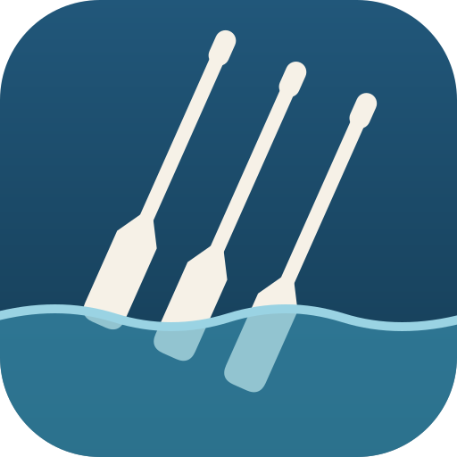
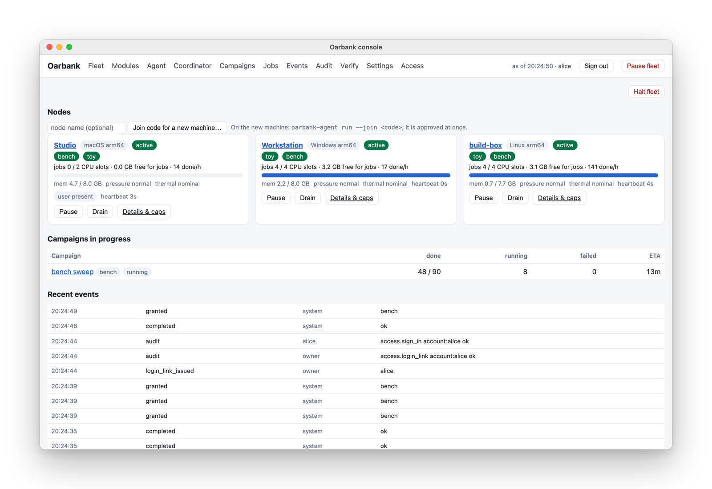
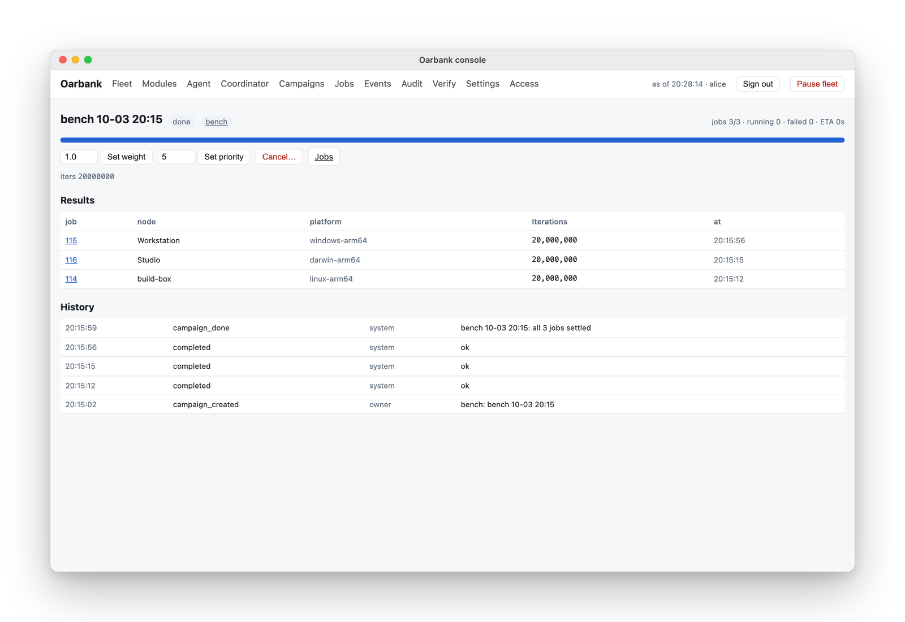
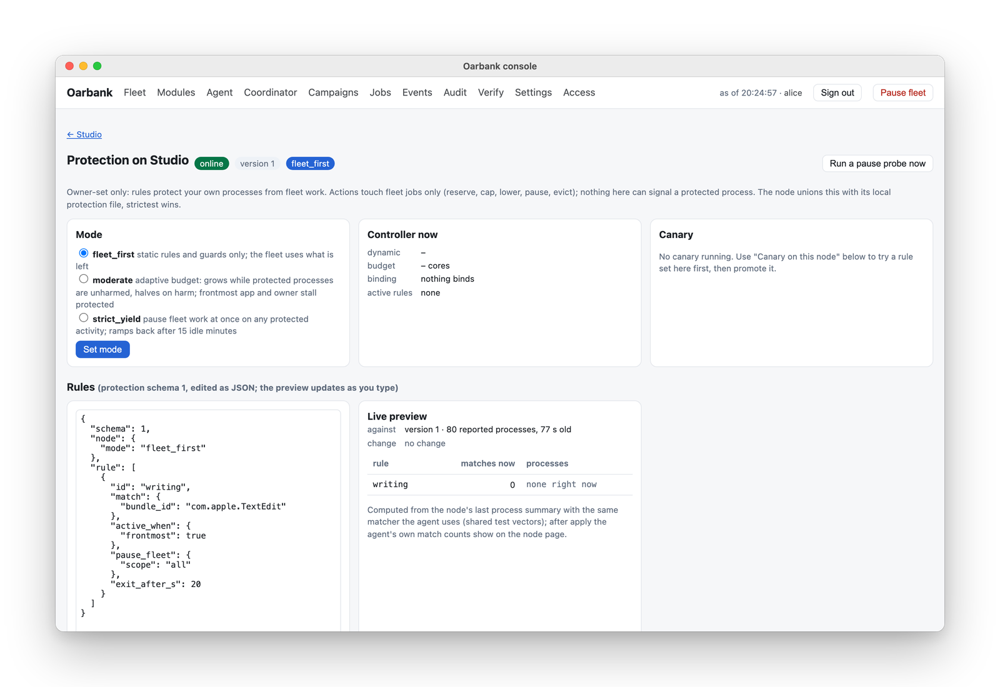
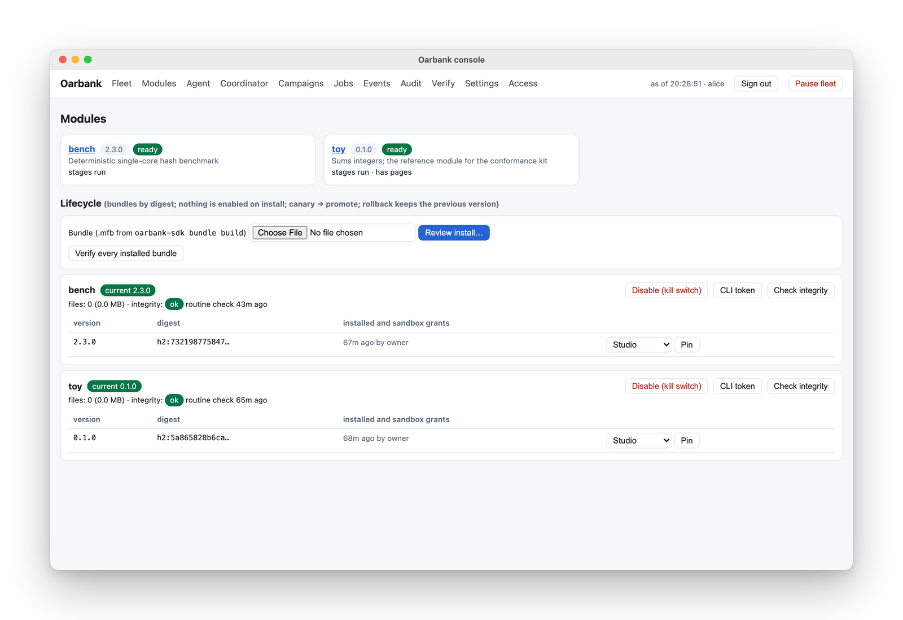
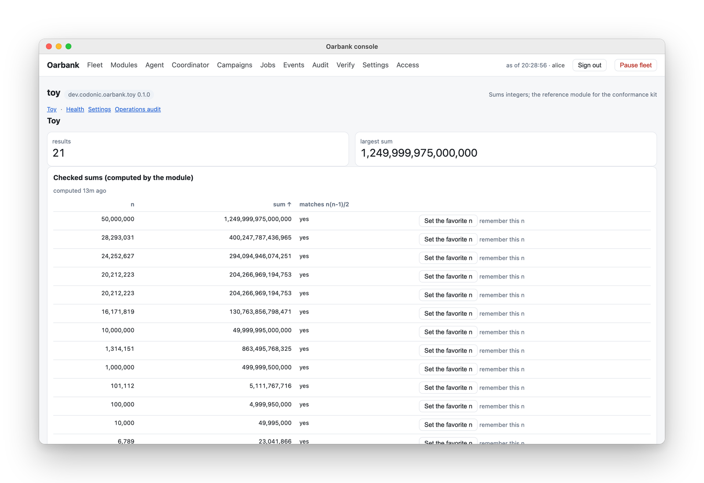

<p align="center">
  
</p>

<h1 align="center">Oarbank</h1>

<p align="center"><b>Spread batch jobs across the computers you already own.</b><br>
A self-hosted job queue for your Macs, Linux machines and Windows PCs: one coordinator, a node on every computer,
the owner's own work first, every job in the operating system's sandbox.</p>

<p align="center">
  <a href="https://github.com/roeehrl/oarbank/actions/workflows/ci.yml"></a>
  <a href="LICENSE.md"></a>
  <a href="https://github.com/roeehrl/oarbank-sdk"></a>
  
</p>

<p align="center">
  <a href="https://docs.codonic.dev/oarbank/">Docs</a> ·
  <a href="https://docs.codonic.dev/oarbank/get-started">Get started</a> ·
  <a href="https://docs.codonic.dev/oarbank/concepts/how-oarbank-works">How it works</a> ·
  <a href="https://docs.codonic.dev/oarbank/build/tutorial">Build a module</a> ·
  <a href="https://codonic.dev/apps/oarbank">Product page</a>
</p>

<p align="center">
  <a href="https://codonic.dev/apps/oarbank">
    <picture>
      <source media="(prefers-color-scheme: dark)" srcset="docs/assets/hero-fleet-dark.png">
      
    </picture>
  </a>
  <br>
  <sub>The console with a made-up demo fleet. <a href="https://codonic.dev/apps/oarbank#inside">Watch the 20-second clip on codonic.dev</a>.</sub>
</p>

> **Release 2.6.0** is out: the installers (macOS pkg for Apple silicon and Intel, deb and rpm, Windows MSI) and
> native coordinator installers and advanced coordinator archives are on the [release page](https://github.com/roeehrl/oarbank/releases/tag/v2.6.0). [Get started](https://docs.codonic.dev/oarbank/get-started)
> walks through the setup.

## What it does

- **Runs one queue on all your computers.** A coordinator on a Mac, a Linux machine or a Windows PC hands jobs to nodes on macOS
  (Apple silicon and Intel), Linux (x86_64 and arm64, systemd) and Windows 10 and 11 (x64 and ARM64). A job goes to a node with
  the CPU, memory and tools it needs; a node that sleeps or leaves gives its work back.
- **Keeps each computer's own work first.** Every node has a memory guard and per-node caps on cores, memory, jobs and
  hours, all off until you set them. Nodes also take fewer jobs while someone is at the computer, follow rules for the
  apps and processes you name, and back off on battery, and on macOS and Linux when hot.
- **Sandboxes every job.** Seatbelt on macOS, Landlock and seccomp on Linux, AppContainers on Windows. A job reads its
  own inputs, writes its own folder, and reaches only the network hosts, host tools, GPU and containers you approved for
  that module version.
- **Certifies nodes before their results count.** A node runs each module's doctor and golden jobs (jobs with known
  answers) first. Replicas on other nodes catch one that drifts, and a node that went quiet can't hand in a stale answer.
- **Runs any kind of batch work as a module.** Parameter sweeps, simulations, renders, benchmarks, test matrices. A
  module is a bundle built with the open-source [Oarbank SDK](https://github.com/roeehrl/oarbank-sdk) (Apache-2.0), with
  its own console pages.
- **Answers to you only.** Nodes join with a one-time join code and talk to the coordinator over mutual TLS. Releases,
  agent updates and coordinator moves need your signature as the owner, and every change is an audited operation.

### Start a campaign; its jobs spread to every node

<picture>
  <source media="(prefers-color-scheme: dark)" srcset="docs/assets/campaign-dark.png">
  
</picture>

A campaign is a set of jobs you start together, from the console or with `oarbank`. The coordinator leases each job to
a certified node with room for it and records who ran what.

### Name the apps that matter; fleet work steps aside

<picture>
  <source media="(prefers-color-scheme: dark)" srcset="docs/assets/protection-dark.png">
  
</picture>

Host protection is set by the owner, per node, and modules can never loosen it. It only ever acts on the fleet's own
jobs (reserve, cap, lower, pause, evict); nothing in it can signal one of your processes. It runs on macOS, Linux and
Windows: rules match your processes by path, name or arguments (and on macOS by code-signing identity or app bundle),
trigger on their CPU, memory or GPU use or on the app in front, and step fleet work aside while someone uses the
machine.

### Install a module, approve its grants, certify it on one node, then promote

<picture>
  <source media="(prefers-color-scheme: dark)" srcset="docs/assets/modules-dark.png">
  
</picture>

Nothing is enabled on install. You review a bundle's sandbox grants, try it on one node (canary), then promote it to
the fleet; a rollback keeps the previous version.

### Modules bring their own console pages

<picture>
  <source media="(prefers-color-scheme: dark)" srcset="docs/assets/module-page-dark.png">
  
</picture>

The SDK's UI contract lets a module add pages, panels and actions to the console without touching the core. `toy`,
the reference module above, sums integers and checks each answer.

## Install

Download the packages for your computers from the [2.6.0 release](https://github.com/roeehrl/oarbank/releases/tag/v2.6.0), check the
[Requirements](https://docs.codonic.dev/oarbank/operate/requirements), and follow
[Get started](https://docs.codonic.dev/oarbank/get-started) or [docs/install.md](docs/install.md). To build the
packages yourself: `scripts/package-macos.sh`, `scripts/package-linux.sh`, `scripts/package-windows.ps1` for agents;
`build-coordinator` followed by `package-coordinator` for the coordinator (see [docs/install.md](docs/install.md)).

Install the coordinator package (`.pkg`, `.deb`/`.rpm`, or `.msi`) for your platform. Open **Oarbank Coordinator**
from Applications or your application menu. Its browser wizard asks for the address your nodes will reach,
your administrator name and password, and an authenticator code. It creates and pins your primary and backup
owner signing keys. Installing the package alone does not configure or start a fleet.

After setup, open the console and create one join code per computer. The coordinator needs its own agent too
if you want it to execute jobs.

Then install the agent on each computer with its join code (the macOS pkg, the deb or rpm, or the Windows MSI). The
node joins, installs its release, runs each module's doctor and golden jobs, and takes work.

## How it works

| Piece | Runs on | What it does |
|---|---|---|
| `oarbankd` | the coordinator | state (SQLite), leases and fencing, dispatch, certification with golden jobs, campaigns, the module store, the internal CA for agents' mutual TLS, the admin API with its hash-chained audit log, accounts (password + TOTP, passkeys, tokens), alerts |
| `oarbank-console` | the coordinator | the browser console, a read-only process; every change is an operation forwarded to `oarbankd` |
| `oarbank-agent` (Rust) | every node | enrollment, releases, sandboxed doctors and jobs, host protection, module services, the container broker, following coordinator moves |
| `oarbank-launcher` (Rust) | every node | runs the agent under the service manager and owns which version runs (side-by-side updates, rollback) |
| `oarbank` | anywhere | the command line over the admin API |

Nodes ask the coordinator for work; the coordinator never reaches into a node. Agents update themselves through your
coordinator, one node first, and a build that doesn't come up healthy within ten minutes rolls back on its own. The
coordinator itself can move to another of your computers: the new one installs a standby from a build you signed,
takes over after a time lock you choose, and every node verifies the move and follows it.

More: [How Oarbank works](https://docs.codonic.dev/oarbank/concepts/how-oarbank-works) ·
[docs/design/architecture.md](docs/design/architecture.md) (including [what is not built yet](docs/design/architecture.md#not-built-yet)) ·
[docs/protocol.md](docs/protocol.md) · [docs/release-signing.md](docs/release-signing.md) ·
[docs/verification.md](docs/verification.md)

## How it treats your data

- **No Codonic service in the path, no account, no telemetry, no crash reporting.** Oarbank runs on your computers
  and your network: a LAN, Tailscale, ZeroTier or any VPN.
- **Your data stays where you run it.** The coordinator keeps its database, accounts, module store, results and logs
  on its own computer; each node keeps its keys, caches and job folders on itself.
- **Nodes send only what scheduling needs** to your coordinator: hardware facts, load, host protection's decisions and
  job results. The coordinator announces itself on the local network so nodes can find it; you can turn that off.
- **The internet only where you point it:** the hosts and container images you approved for a module (used from
  inside its sandbox), dataset origins you register, a rescue location for coordinator moves, and a notification
  server if you turn notifications on.

## Why not …?

| | Good at | Why you might pick Oarbank instead |
|---|---|---|
| **GNU parallel / ssh loops** | Zero setup; perfect for a one-off batch on machines you're not using | No scheduling around each machine's own load, no retries or result checks across machines, no Windows nodes |
| **Ray** | Python-native distributed computing, from a laptop to big clusters | Cluster-first: no host protection for machines people work on, and your code is written against Ray. Oarbank runs existing programs as modules |
| **HTCondor / BOINC** | Proven cycle scavenging for campuses and volunteer computing, at very large scale | Built for institutions; heavier to set up and run for a handful of personal machines |
| **Slurm / Nomad** | Data-centre and server scheduling | Assume dedicated servers; no notion of "someone is using this computer right now" |
| **Celery / RQ** | Task queues inside your own application | You run the broker and the workers and write the tasks; no sandbox and no node certification |
| **Cloud batch** (AWS Batch and friends) | Elastic capacity on demand | Costs money per hour, and your data leaves your machines |

Oarbank is a good fit for **2 to about 20 mixed computers** you own and use, running work that splits into independent
jobs. If you already run a cluster scheduler on dedicated servers, keep it.

## FAQ

**Can I install it today?** Yes: the [2.6.0 release](https://github.com/roeehrl/oarbank/releases/tag/v2.6.0) has the installers for macOS, Linux and Windows.
[Get started](https://docs.codonic.dev/oarbank/get-started) has the requirements and the steps.

**What do I need?** Two or more computers that can reach one another: a Mac, a Linux machine or a Windows PC for the
coordinator (it can be a node too), and Macs, Linux machines or Windows PCs as nodes.

**Will it slow my computer down?** It is built not to: the memory guard stops taking jobs when free memory runs low and
evicts the fleet's jobs if it keeps falling, and caps limit cores, memory, jobs and hours. It also yields to the person
at the computer and to the apps you name, on macOS, Linux and Windows.

**Can a job read my files?** No. Every job runs in the operating system's sandbox and reads only its inputs and its
module, and writes only its own folders. Network hosts, host tools, the GPU and containers are grants you approve per
module version. Containers run on the agent's own runtime (a Colima VM on macOS, rootless Podman on Linux, a WSL
containers session on Windows) and see only the job's folders.

**What happens if a node goes offline mid-job?** Its lease runs out and the coordinator gives the job to another
node. An answer from the lost lease is not counted.

**Is it open source?** The core is source-available (see Licence); the [SDK](https://github.com/roeehrl/oarbank-sdk)
is open source under Apache-2.0, so anyone can build and share modules.

## Contributing

Issues and pull requests are welcome. Read [CONTRIBUTING.md](CONTRIBUTING.md) first: it grants the permission to fork
and change the code for the purpose of contributing, and your first pull request asks you to sign the
[Contributor License Agreement](CLA.md) once (you keep the copyright in your work). Open an issue before anything
larger than a small fix. Security problems go to support@codonic.dev, not to a public issue.

```bash
uv sync --extra dev
uv run pytest --ignore=tests/rust            # coordinator: unit, HTTP, console, protection, modules, simulation
(cd rust && cargo test --workspace)          # agent, launcher and protection crates
uv run pytest tests/rust                     # the agent end to end against real oarbankd processes
```

New kinds of work belong in modules, not in the core: start with the SDK's
[tutorial](https://docs.codonic.dev/oarbank/build/tutorial) and check your module with `oarbank-sdk conform`.

## Licence

Oarbank's core is **source-available** under the [PolyForm Strict License 1.0.0](LICENSE.md): free for personal and
noncommercial use. Commercial use needs a licence from Codonic: write to support@codonic.dev. The
[module SDK](https://github.com/roeehrl/oarbank-sdk) is open source under the **Apache License 2.0**.

Oarbank and the Oarbank logo are trademarks of Codonic Dev, LLC. macOS, Windows and other product names are trademarks
of their owners and are named only to describe compatibility.

